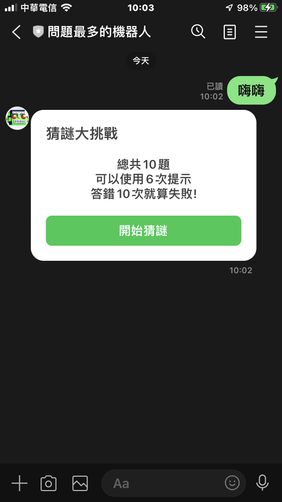
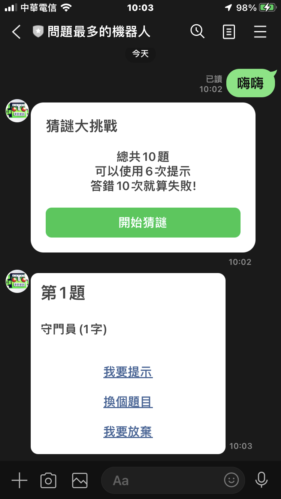
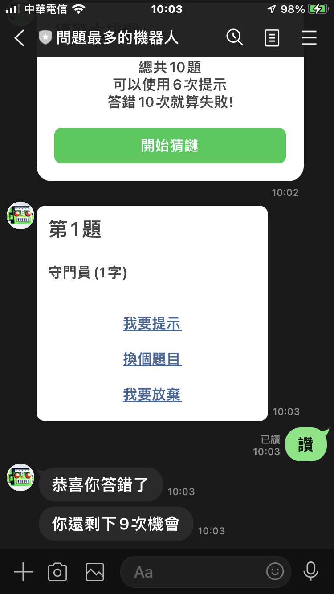
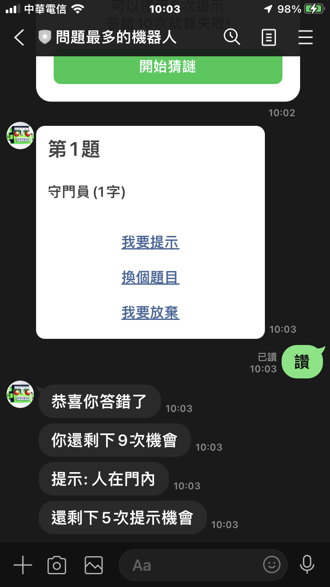
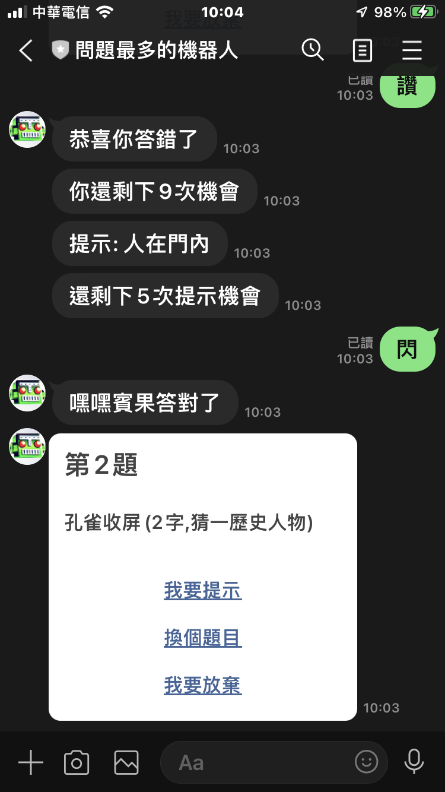
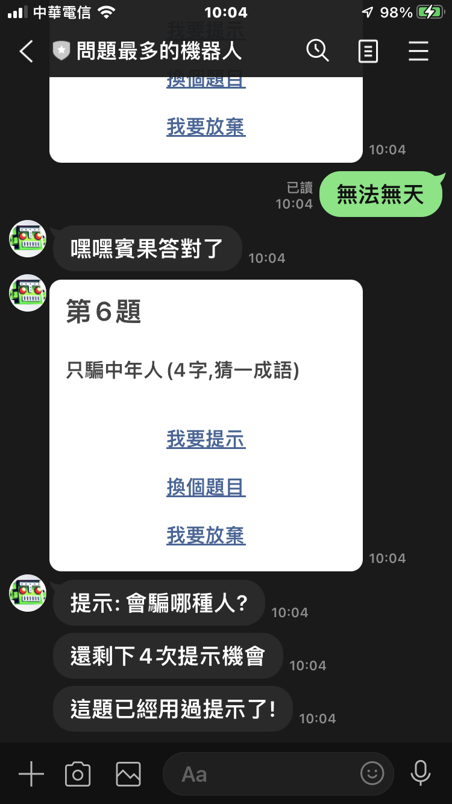
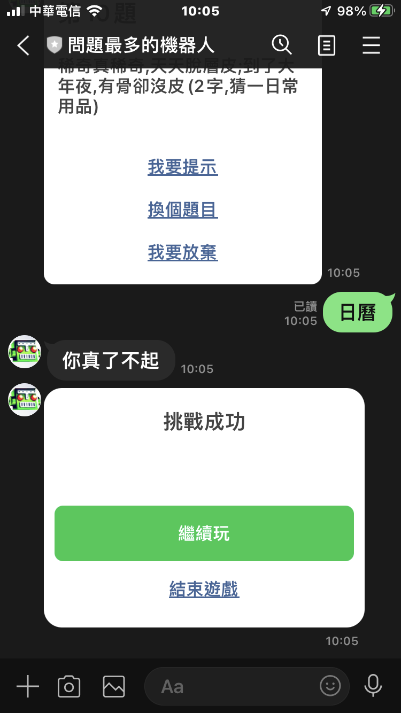
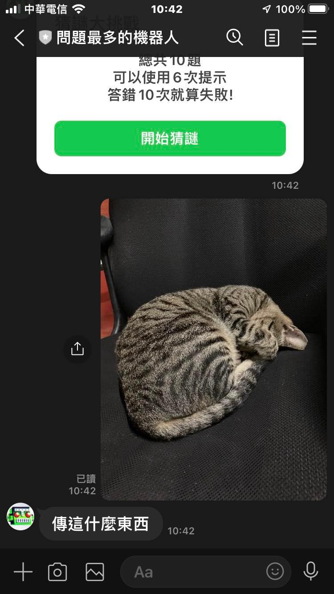
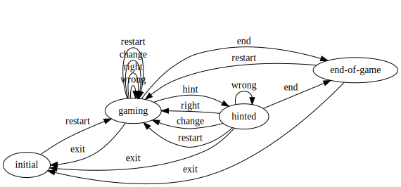

# Puzzle-Bot

## User Guide

**Puzzle-Bot** is an amusing [LINE](https://line.me/zh-hant/) Bot which provides users interesting puzzles to figure out.

### Game Rules

* A User answer the puzzles sent by Puzzle-Bot, and it takes **10 correct answers** to win a game.
* A user will have at most **one chance to get 1 hint** from Puzzle-Bot **for each puzzle**, but can totally **get 6 hints in an entire game**.
* The user will fail with **10 wrong guesses** in a game.

### Game Flow

1. Add **Puzzle-Bot(問題最多的機器人)** on your [LINE](https://line.me/zh-hant/) .
2. Send any **text message** to Puzzle-Bot, it will reply a **flex message** with a **start button(開始猜謎)**.
3. Press the start button,  Puzzle-Bot will send your first puzzle via a new flex message.
4. User can choose to answer the question by sending a text message to Puzzle-Bot, or choose a button on puzzle message to press to **get a hints(我要提示)**, **change the puzzle to another(換個題目)** or **leave the game(我要放棄)**.
5. The game will end for the user has solved 10 puzzles correctly, made 10 wrong guesses or press the leave button.
6. If the user wins or loses the game, Puzzle-Bot will send another flex message to ask the user to **start another game(我要繼續)** or **leave(結束遊戲)** via pressing one of the two buttons on flex message.

### Demo

* Send the first text message to Puzzle-Bot, it replies a flex message with a start button:

  

* Press the start button to start the game, user will get the first puzzle of the game from Puzzle-Bot: 

  

* Send a text message as the answer of the puzzle, but Puzzle-Bot noticed that it is a wrong guess and the remaining chances for incorrect answers of the user:

  

* Press the hint button to get a hint from Puzzle-Bot, it will also notice that the remaining chances for using hints:

  

* Send a new text message with the correct answer, Puzzle-Bot will send a greeting message and the next puzzle:

  

* But if the user ask for hint for a puzzle is already hinted, he/she will get a notification from Puzzle-Bot:

  

* Choose to play again or leave when the game is finished:

  

* It is forbidden to send messages other than text:

  

## Dependencies

Puzzle-Bot is a project based on [Node.js](https://nodejs.org/en/), below are the packages used by Puzzle-Bot:

* [linebot](https://github.com/boybundit/linebot)
* [javascript-state-machine](https://github.com/jakesgordon/javascript-state-machine)

Use the following commands to install the required packages: 

* `npm install javascript-state-machine --save `

* `npm install linebot --save`

## State machine

| State         | Condition                                                    | Bot Behavior                                                 |
| ------------- | ------------------------------------------------------------ | ------------------------------------------------------------ |
| `initial`     | Before a game is started                                     | Send a start message to user                                 |
| `gaming`      | A game is started and the hint of current puzzle is not given to the user | Send a puzzle message to user once and then wait for the user to answer the puzzle or ask for assists |
| `hinted`      | A game is started and the user has got the hint of this puzzle | Wait for the user to answer the puzzle or ask for assists    |
| `end-of-game` | The user won or lost the game                                | Send a message to user and waiting he/she to choose  to leave the game or play again |